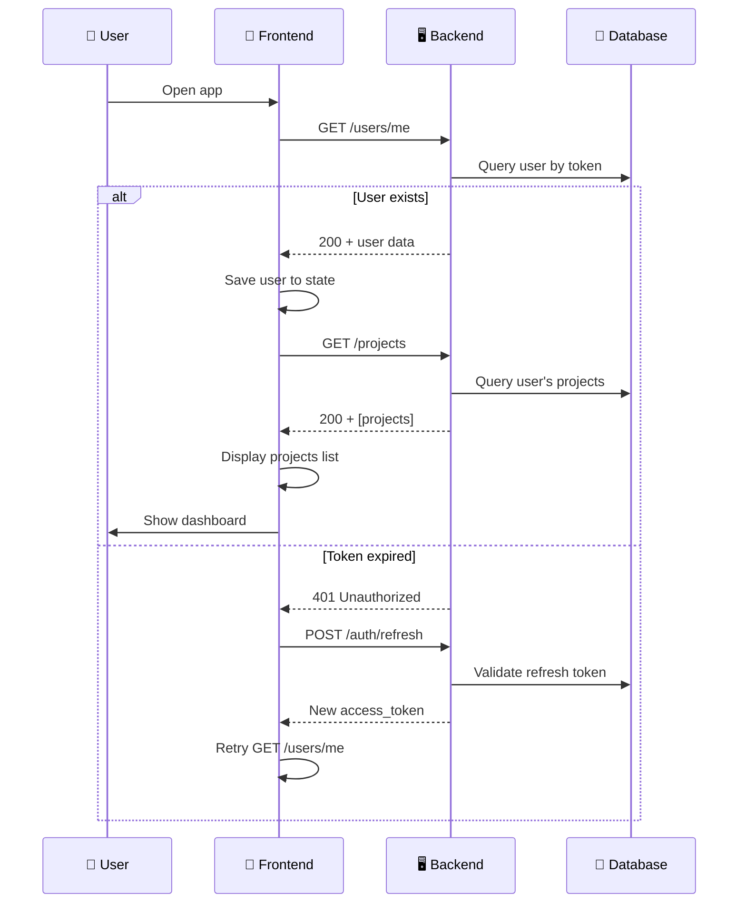
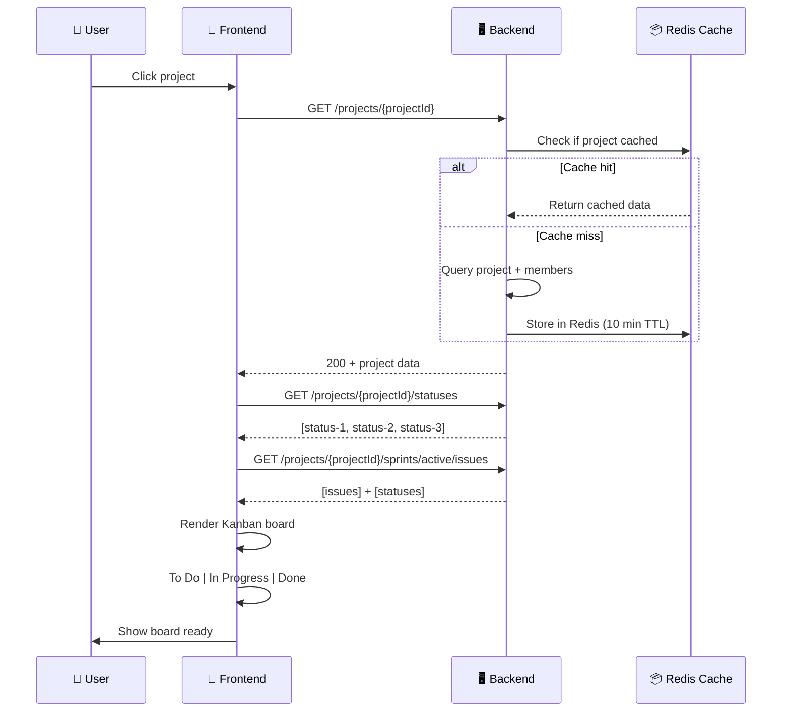
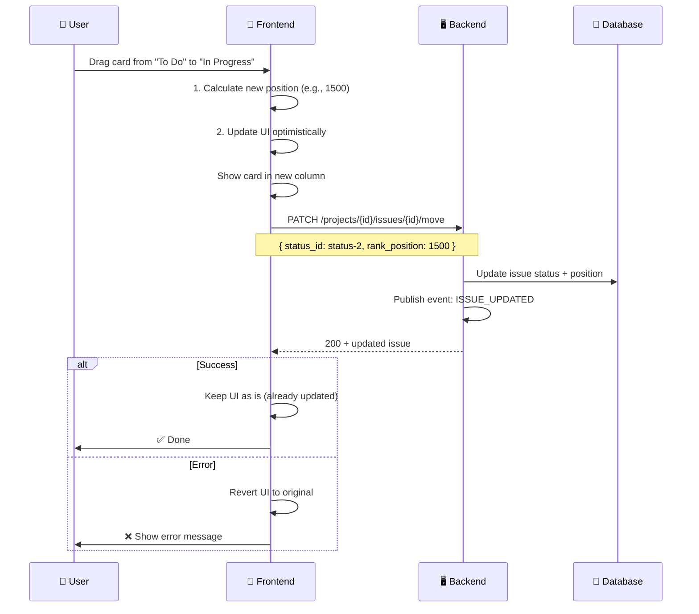
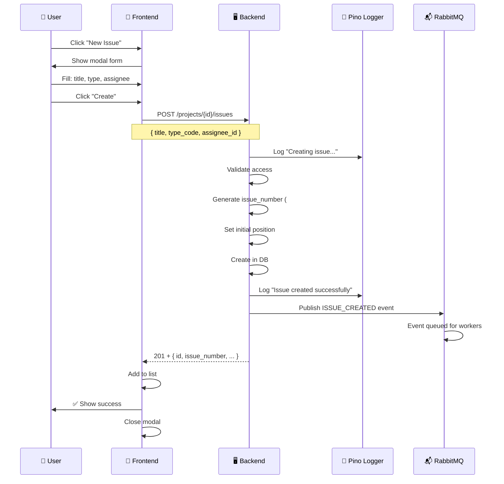
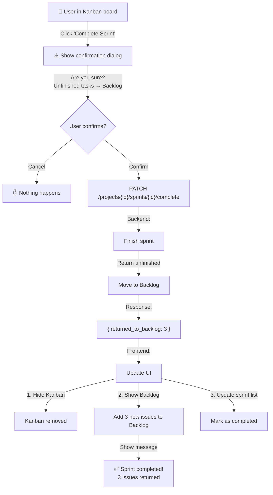
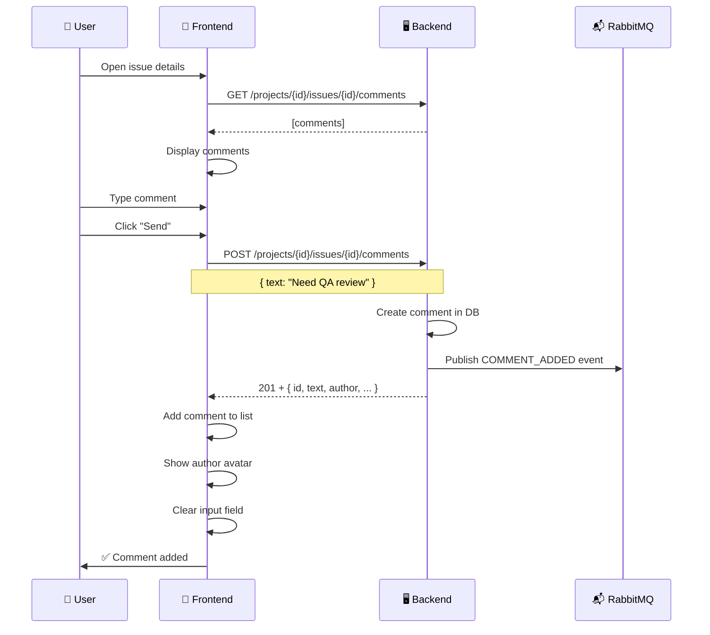
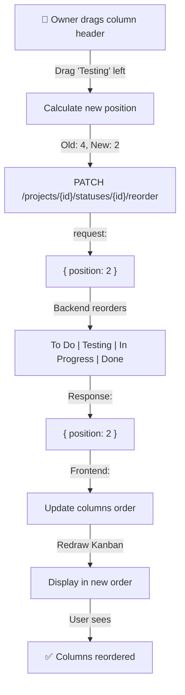
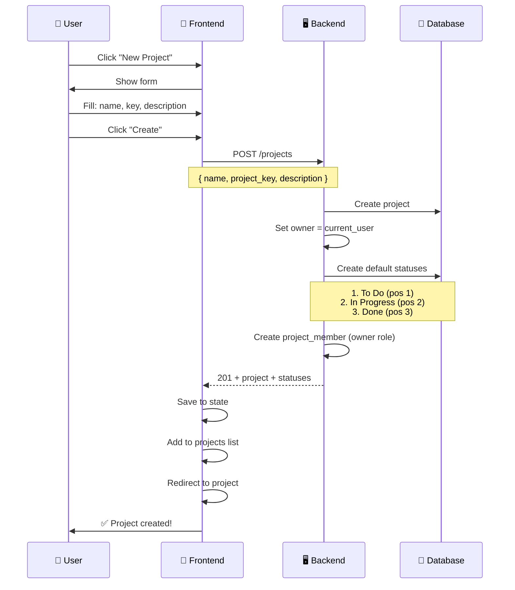
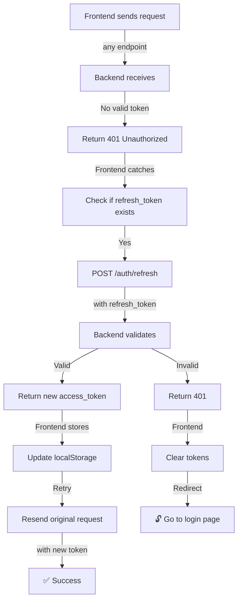

# 🎯 FRONTEND API FLOWS: Диаграммы основных сценариев

Визуальные диаграммы всех основных пользовательских потоков и соответствующих API вызовов.

---

## 1️⃣ Сценарий: Первый запуск приложения



---

## 2️⃣ Сценарий: Просмотр Kanban доски



---

## 3️⃣ Сценарий: Drag-n-Drop задачи между колонками ⭐ ВАЖНО



---

## 4️⃣ Сценарий: Планирование спринта (Sprint Planning)

```mermaid
graph TD
    A["👤 User opens Sprint Planning"] -->|GET /projects/{id}/sprints| B["📋 Load all sprints"]
    B --> C["Choose Sprint or Create New"]
    
    C -->|POST /projects/{id}/sprints| D["✨ Create Sprint"]
    D -->|sprintId| E["📌 Sprint created"]
    
    E -->|GET /projects/{id}/issues<br/>status_category=backlog| F["📊 Load Backlog"]
    F -->|Show 2-column view| G["Left: Backlog<br/>Right: Sprint"]
    
    G -->|User drags issue| H{"Drag-n-Drop"}
    H -->|Drop in sprint| I["PATCH /projects/{id}/issues/{id}"]
    I -->|sprint_id: sprint-123| J["Issue moved to sprint"]
    
    J -->|When ready| K["PATCH /projects/{id}/sprints/{id}/start"]
    K -->|is_active: true| L["🚀 Sprint started!"]
    L -->|GET /sprints/{id}/active/issues| M["Load Kanban board"]
```

---

## 5️⃣ Сценарий: Создание задачи в Backlog



---

## 6️⃣ Сценарий: Завершение спринта



---

## 7️⃣ Сценарий: Добавление комментария к задаче



---

## 8️⃣ Сценарий: Переупорядочивание колонок



---

## 9️⃣ Сценарий: Создание проекта



---

## 🔟 Сценарий: Обработка ошибок (401 - Token Expired)



---

## 📊 Матрица: Действие → Endpoint

### Категория: ISSUES (Задачи)

| Действие | Endpoint | Метод | Flow |
|----------|----------|-------|------|
| **Создать задачу** | `/projects/{id}/issues` | POST | [Сценарий 5️⃣](#5️⃣-сценарий-создание-задачи-в-backlog) |
| **Переместить между колонками** | `/projects/{id}/issues/{id}/move` | PATCH | [Сценарий 3️⃣](#3️⃣-сценарий-dragndrop-задачи-между-колонками--важно) |
| **Добавить в спринт** | `/projects/{id}/issues/{id}` | PATCH | [Сценарий 4️⃣](#4️⃣-сценарий-планирование-спринта-sprint-planning) |
| **Загрузить backlog** | `/projects/{id}/issues?status_category=backlog` | GET | [Сценарий 4️⃣](#4️⃣-сценарий-планирование-спринта-sprint-planning) |
| **Загрузить для Kanban** | `/projects/{id}/sprints/active/issues` | GET | [Сценарий 2️⃣](#2️⃣-сценарий-просмотр-kanban-доски) |

### Категория: SPRINTS (Спринты)

| Действие | Endpoint | Метод | Flow |
|----------|----------|-------|------|
| **Создать спринт** | `/projects/{id}/sprints` | POST | [Сценарий 4️⃣](#4️⃣-сценарий-планирование-спринта-sprint-planning) |
| **Запустить спринт** | `/projects/{id}/sprints/{id}/start` | PATCH | [Сценарий 4️⃣](#4️⃣-сценарий-планирование-спринта-sprint-planning) |
| **Завершить спринт** | `/projects/{id}/sprints/{id}/complete` | PATCH | [Сценарий 6️⃣](#6️⃣-сценарий-завершение-спринта) |
| **Загрузить список** | `/projects/{id}/sprints` | GET | [Сценарий 4️⃣](#4️⃣-сценарий-планирование-спринта-sprint-planning) |

### Категория: STATUSES (Колонки)

| Действие | Endpoint | Метод | Flow |
|----------|----------|-------|------|
| **Создать колонку** | `/projects/{id}/statuses` | POST | Создание |
| **Загрузить все** | `/projects/{id}/statuses` | GET | [Сценарий 2️⃣](#2️⃣-сценарий-просмотр-kanban-доски) |
| **Переупорядочить** | `/projects/{id}/statuses/{id}/reorder` | PATCH | [Сценарий 8️⃣](#8️⃣-сценарий-переупорядочивание-колонок) |

### Категория: COMMENTS (Комментарии)

| Действие | Endpoint | Метод | Flow |
|----------|----------|-------|------|
| **Добавить** | `/projects/{id}/issues/{id}/comments` | POST | [Сценарий 7️⃣](#7️⃣-сценарий-добавление-комментария-к-задаче) |
| **Загрузить** | `/projects/{id}/issues/{id}/comments` | GET | [Сценарий 7️⃣](#7️⃣-сценарий-добавление-комментария-к-задаче) |

### Категория: PROJECTS (Проекты)

| Действие | Endpoint | Метод | Flow |
|----------|----------|-------|------|
| **Создать** | `/projects` | POST | [Сценарий 9️⃣](#9️⃣-сценарий-создание-проекта) |
| **Загрузить список** | `/projects` | GET | [Сценарий 1️⃣](#1️⃣-сценарий-первый-запуск-приложения) |
| **Загрузить детали** | `/projects/{id}` | GET | [Сценарий 2️⃣](#2️⃣-сценарий-просмотр-kanban-доски) |

---

## 🎓 Как читать диаграммы

### Sequencediagram (Последовательность)
- 👤 User = пользователь
- 🎨 Frontend = React приложение
- 🖥️ Backend = NestJS сервер
- 💾 Database = PostgreSQL
- 📬 RabbitMQ = очередь событий
- 📝 Logger = Pino логирование

**Стрелки:**
- → = синхронный запрос
- ← = ответ
- ⟿ = асинхронный процесс

### Graph (Граф)
- A →| text | B = переход с условием
- { } = условный выбор (if-else)
- [[ ]] = результат

---

## 💡 Ключевые закономерности

### 1. Все GET запросы для статических данных кешируются
```
GET /projects/{id}
→ Cache hit: 15ms
→ Cache miss: 200ms
→ Cached for 10 minutes
```

### 2. Все CREATE/UPDATE/DELETE публикуют события
```
POST /issues
→ Backend логирует
→ Backend публикует в RabbitMQ
→ API ответила уже (не ждет)
```

### 3. Большинство операций требуют проверки доступа
```
PATCH /projects/{id}
→ Проверка: user is project member/owner
→ Если нет: 403 Forbidden
```

### 4. Архивированные проекты read-only
```
PATCH /archived-project
→ 409 Conflict
→ "Project is archived - read-only mode"
```

---

## 🔍 Как использовать эти диаграммы

1. **Фронтендеру:** Откройте нужный сценарий, посмотрите какой endpoint нужно вызвать
2. **Бэкендеру:** Используйте как спецификацию того, что нужно поддерживать
3. **Тестировщику:** Используйте как checklist для тестирования
4. **Новому разработчику:** Изучайте систему через сценарии

---

**Версия:** 1.0  
**Дата:** May 14, 2026  
**Формат:** Markdown + Mermaid Diagrams  
**Инструменты для просмотра:** GitHub, VS Code + Markdown Preview
